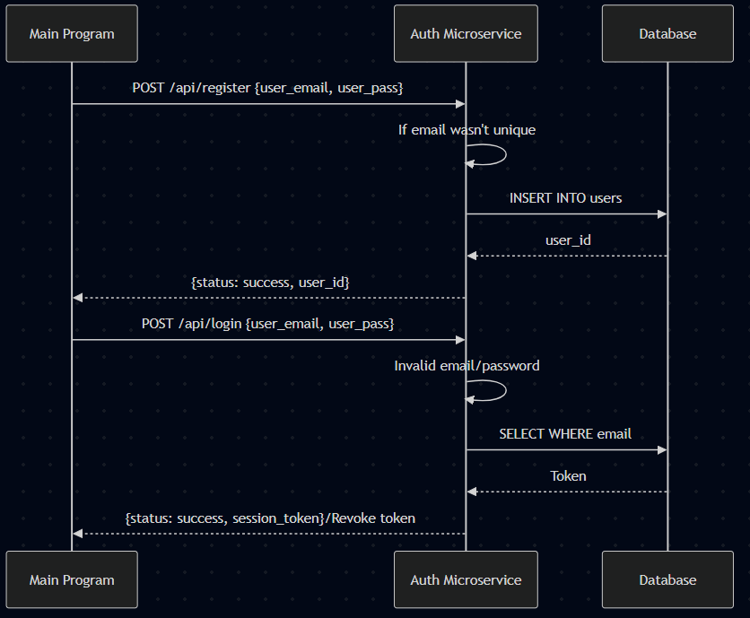

# authentication-microservice

Authentication microservice for user registration, login, and secure password resets. Uses SQLite for persistence and Flask-Bcrypt for secure password hashing.

## How to run

1. **Create a virtualenv and install dependencies:**
   ```powershell
   # Open file in VSCode and open a new terminal (PowerShell)
   python -m venv venv
   .\venv\Scripts\activate   # On Windows PowerShell
   python -m pip install flask flask-bcrypt requests
   ```
3. **Start the server**
   ```powershell
   python auth_service.py
   # Server listens on http://localhost:5000
   ```
4. **Run Test API:**
   ```powershell
   # Open new terminal and run:
   python test_api.py
   ```
## How to request data
To request data, the calling program must send an HTTP POST request to the desired endpoint with a JSON-formatted body.
<br><br>
**Example Call (Python):**
Request to register a new user with a username and a password
```python
import requests

# The request payload
request_payload = {"user_email": "user@example.com", "user_pass": "SecurePass123"}

# Sending the programmatic request
response = requests.post("http://localhost:5000/api/register", json=request_payload)
```
## How to receive data
To receive data, the microservice responds with a JSON object. The calling program must parse this JSON to receive the status and data values.
<br><br>
**Example Receive (Python):**
```python
# Receiving the response
received_data = response.json()

# Extracting data from the JSON response
if received_data.get("status") == "success":
    user_id = received_data.get("user_id")
    print(f"Successfully registered! Received User ID: {user_id}")
else:
    error = received_data.get("error_message")
    print(f"Registration failed: {error}")
```

## Communication Contract

The following table defines the programmatic interface for this microservice.

| Endpoint | Method | Purpose | Data to Send (Request) | Data to Receive (Response) |
| :--- | :--- | :--- | :--- | :--- |
| `/api/register` | POST | Creates a new user | `user_email`, `user_pass` | `status`, `user_id` |
| `/api/login` | POST | Verifies credentials | `user_email`, `user_pass` | `status`, `session_token` |
| `/api/request-reset` | POST | Starts reset flow | `user_email` | `status`, `reset_token` |
| `/api/reset-password` | POST | Updates password | `reset_token`, `new_password` | `status`, `message` |

---
## UML Diagram

